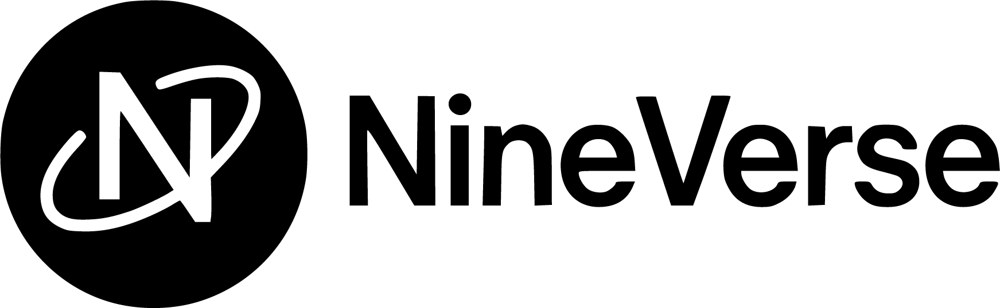

<p align="center"><a href="https://github.com/Appsventory/NineVerse" target="_blank"></a></p>

<p align="center">
  <strong>A simple and flexible PHP framework that helps you build websites and web applications with ease</strong>
</p>

<br>

<div align="center">
  <a href="https://github.com/Appsventory/NineVerse/releases/latest">
    
  </a>
  <a href="https://github.com/Appsventory/NineVerse/stargazers">
    
  </a>
  <a href="https://github.com/Appsventory/NineVerse/network/members">
    
  </a>
  <br>
  <a href="https://github.com/Appsventory/NineVerse/releases">
    
  </a>
  <a href="https://github.com/Appsventory/NineVerse/commits/main">
    
  </a>
  
</div>

## ✨ Key Features

- 🎯 **Simple & Lightweight** - Minimalist framework that's easy to understand and use
- ⚡ **High Performance** - Fast and efficient without unnecessary overhead
- 🔧 **Full Control** - Complete control over your application without excessive complexity
- 🚀 **Easy Setup** - Simple installation and configuration process
- 📝 **Clean Code** - Clean code structure that's easy to maintain
- 📱 **Modern PHP** - Leverages the latest PHP 8.3+ features

## 🛠 Technology Stack

### Core Framework
- **PHP 8.3+** - Modern PHP with latest features
- **Custom Routing** - Simple yet powerful routing system
- **Template Engine** - Lightweight and flexible template system
- **Middleware Support** - Request filtering and processing

### Database Support
- **MySQL** - Primary database support with full feature set
- **SQLite** - Lightweight database option for development

## 📋 System Requirements

- **PHP** >= 8.3
- **Web Server** - Apache/Nginx with URL rewriting
- **Database** - MySQL 5.7+ or SQLite 3+
- **Composer** - For dependency management (recommended)

## 🚀 Quick Start

### 1. Clone Repository
```bash
git clone https://github.com/Appsventory/NineVerse.git
cd NineVerse
```

### 2. Install Dependencies (Optional)
```bash
composer install
```

### 3. Configure Environment
```bash
cp .env.example .env
# Edit .env file with your configuration
```

### 4. Start Development Server
```bash
php fany server --port 8000
```

### 5. Access Your Application
Open your browser and navigate to: `http://localhost:8000`

## 🏗️ Project Structure

```
NineVerse/
├── app/                    # Core application directory
│   ├── Console/            # Command line tools and scripts
│   ├── Controllers/        # HTTP request controllers
│   ├── Core/              # Framework core components (Router, Database, etc.)
│   ├── Exceptions/        # Custom exception handlers
│   ├── Helpers/           # Helper functions and utility classes
│   ├── Middleware/        # HTTP middleware for request filtering
│   ├── Models/            # Data models and business logic
│   ├── Routes/            # Route definitions
│   │   └── web.php        # Web routes configuration
│   └── Views/             # Template files and layouts
├── public/                # Web accessible files (Document Root)
│   ├── assets/            # Static assets (images, fonts, files)
│   ├── css/               # Stylesheet files
│   ├── js/                # JavaScript files
│   ├── storage/           # Public storage for uploaded files
│   ├── index.php          # Application entry point
│   └── .htaccess          # Apache URL rewriting rules
├── storage/               # Private application storage
│   ├── logs/              # Application logs
│   ├── cache/             # Application cache
│   └── temp/              # Temporary files
├── vendor/                # Third-party packages and dependencies
├── .env                   # Environment variables and configuration
├── .env.example           # Environment configuration template
├── composer.json          # Composer dependencies
└── fany                   # Custom CLI tool for development tasks
```

## 📖 Documentation

### Core Concepts
- [Routing System](https://github.com/Appsventory/NineVerse/blob/main/docs/routing.md)
- [Models & Database](https://github.com/Appsventory/NineVerse/blob/main/docs/database.md)

### Advanced Topics
- [Middleware](https://github.com/Appsventory/NineVerse/blob/main/docs/middleware.md)
- [Nixs Template Engine](https://github.com/Appsventory/NineVerse/blob/main/docs/nixs.md)
- [CLI Commands](https://github.com/Appsventory/NineVerse/blob/main/docs/cli.md)


<a href="https://github.com/Appsventory/NineVerse/graphs/contributors">
  
</a>

## 📊 Project Stats


## 🆘 Support & Community

Need help? Join our community and get support:

- 📧 **Email**: screative010@gmail.com
- 🐛 **Bug Reports**: [GitHub Issues](https://github.com/Appsventory/NineVerse/issues)
- 💬 **Discussions**: [GitHub Discussions](https://github.com/Appsventory/NineVerse/discussions)
- 📚 **Wiki**: [Documentation Wiki](https://github.com/Appsventory/NineVerse/wiki)
- 💡 **Feature Requests**: [Request Features](https://github.com/Appsventory/NineVerse/issues/new?template=feature_request.md)


## 📜 License

This project is licensed under the MIT License

## 🙏 Acknowledgments

- Thanks to the PHP community for inspiration and best practices
- Special thanks to all contributors and early adopters
- Built with ❤️ by the ICK Network Team

---

<p align="center">
  <strong>Made with ❤️ by ICK Network Team</strong>
</p>

<p align="center">
  <a href="https://github.com/Appsventory/NineVerse">⭐ Star this repository if you find it helpful!</a>
</p>